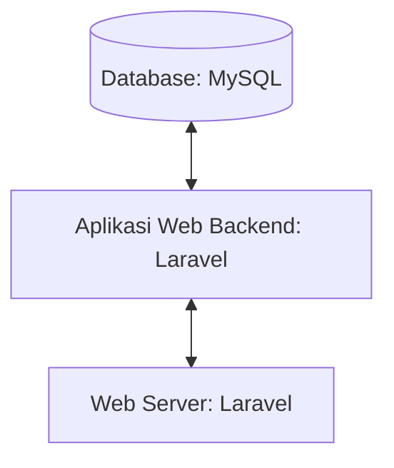

## 1.1 Latar Belakang

Our.Pharmacy adalah sebuah platform belanja online yang memungkinkan pengguna untuk menjual dan membeli berbagai jenis obat - obatan maupun alat medis yang dibutuhkan. Our.Pharmacy menawarkan berbagai jenis produk obat - obatan serta berbagai alat maupun bahan yang dibutuhkan tenaga medis serta pasien. Pengguna bisa mencari produk medis yang dibutuhkan berdasarkan jenis penyakit, gejala, atau merek. Aplikasi ini berfokus pada pemberian pengalaman mendapatkan berbagai jenis produk medis dengan praktis, nyaman dan terjamin kualitasnya dengan informasi produk yang jelas dan berkualitas, dengan gambar yang baik, serta deskripsi yang terpercaya. Tujuan utama dari aplikasi ini adalah untuk memenuhi kebutuhan konsumen dalam bidang medis dengan kualitas terjamin dan pengalaman belanja yang memuaskan secara daring. 

## 1.2. Deksripsi Teknologi Informasi

Our.Pharmacy memberikan pengalaman jual beli yang praktis serta terjamin kualitasnya. Dengan menyediakan beragam produk, inovasi teknologi medis untuk pengalaman yang lebih baik, pelayanan pelanggan yang responsif, serta fokus pada keberlanjutan dan kualitas.

## 1.3. Branding

Merk : Our.Pharmacy

Tagline : "Get your health back! :)" 

Campaign : Membuat aplikasi sederhana dimana penggunanya bisa dengan mudah menjual dan memmbeli produk medis yang berkualitas dan terpercaya.

Target user :
- Semua Usia
- Pasien yang membutuhkan obat
- Tenaga medis atau rekan medis
  
User experience theme:
- Praktis
- Berkualitas
- Terpercaya

   

## 2. User Story

sebagai | saya ingin bisa | sehingga | prioritas
---|---|---|---
Admin | Mengakses data user  | Bisa update data user dan menghapus data user | ⭐⭐⭐⭐⭐
Admin | Mengakses data transaksi  | Bisa melihat detail transaksi dan mengubah status transaksi | ⭐⭐⭐⭐⭐
Admin | Upload Product  | Banyak product yang bisa dipilih user  | ⭐⭐⭐⭐⭐
Admin | Edit Product  | Bisa merubah harga, deskripsi, nama product | ⭐⭐⭐⭐⭐
Admin | Hapus Product  | Bisa menghapus product | ⭐⭐⭐⭐⭐
Pengguna | Melihat semua product | Mendapatkan banyak piliha furnitur  | ⭐⭐⭐⭐
Pengguna | Melihat detail furnitur | Bisa meliahat deskripsi lengkap furnitur  | ⭐⭐⭐⭐
Pengguna | Menyimpan furnitur yang akan dibeli didalam keranjang | Dapat memilih kembali furnitur sebelum di checkout  | ⭐⭐⭐⭐
Pengguna | Memilih jasa kirim | Bisa menyesuaikan dengan jasa kirim yang diinginkan  | ⭐⭐⭐
Pengguna | Memilih Media Pembayaran | Bisa menyesuaikan payment yang dipunya  | ⭐⭐⭐⭐⭐

## 3. Struktur Data

## 4. Arsitektur Sistem

## 5. Teknologi, Library, dan Framework

- UI/UX Design : Figma
- Web Server   : Laragon
- Text Editor  : VS Code
- Browser      : Chrome
- Library      : Laravel Jetstream
- Framework    : Laravel
- Database     : MySQL
  

## 6. Desain User Experience dan User Interface

Landing Page 

Details Page

Succsess Page

## 7. Demonstrasi Video

Link youtube nya

## 8. Bagaimana mesin komputasi dan sistem operasi berperan dalam produk teknologi informasimu ?

Link youtube nya di detik jawaban ini

## 9. Bagaimana algoritma, struktur data, dan bahasa pemrograman berperan dalam produk teknologi informasimu ?

Link youtube nya di detik jawaban ini

## 10. Bagaimana metode pengembangan perangkat lunak / Software Development Life Cycle berperan dalam produk teknologi informasimu ?

Link youtube nya di detik jawaban ini

## 11. Bagaimana database / sistem basis data berperan dalam produk teknologi informasimu ?

Link youtube nya di detik jawaban ini
